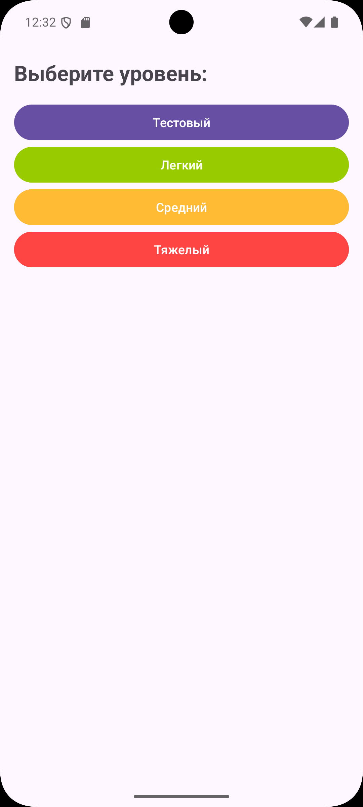
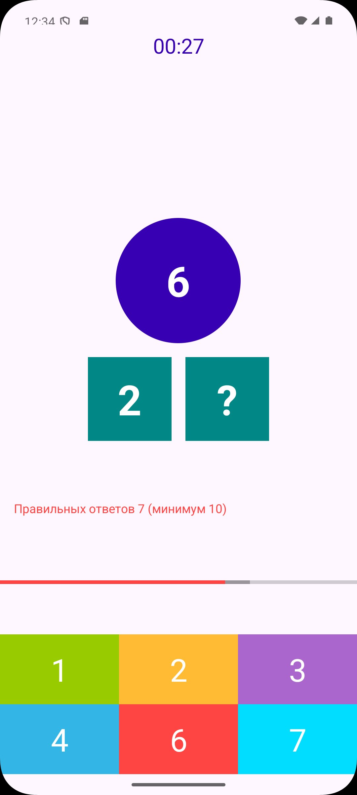
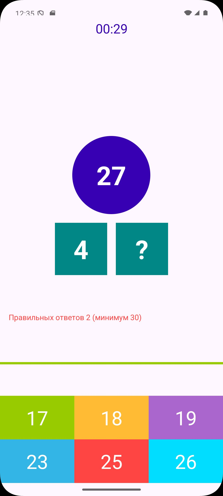

# Composition

**Composition** - приложение для тренировки устного счёта и понимания состава числа.

Игроку показывается сумма и одно из слагаемых. Необходимо выбрать недостающее число так, чтобы сумма двух нижних чисел совпала с числом в верхнем круге. Игра ограничена по времени и оценивает результат по количеству и проценту правильных ответов.

## Скриншоты

## Возможности

- выбор уровня сложности (легкий, средний, сложный, тестовый);
- случайная генерация математических заданий;
- несколько вариантов ответа;
- ограничение времени на прохождение;
- отображение текущего прогресса;
- подсчёт правильных ответов;
- расчёт процента правильных ответов;
- экран итогового результата;
- возможность начать игру заново.

## Технологии

- Kotlin;
- Android SDK;
- MVVM;
- Clean Architecture;
- LiveData;
- Data Binding;
- Android Navigation Component;
- Safe Args;
- ViewModel;
- Fragments;
- ConstraintLayout;
- Material Design Components;
